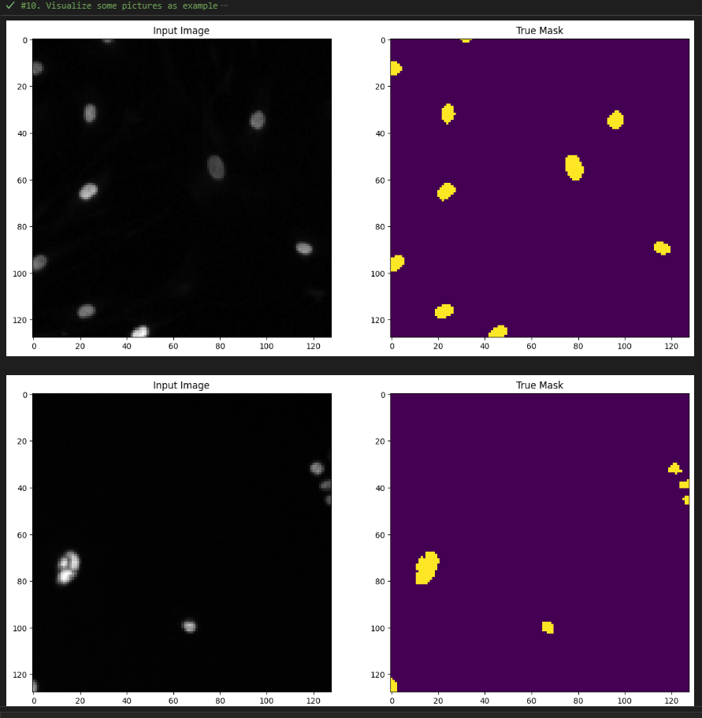

## 
 
 
 
 
 

# Nuclei Image Segmentation
A Deep Learning project on how to create a model for semantic segmentation for images containing cell neuclei.

## Project Description
An algorithm that can automatically detect nuclei to expedite research on a wide range of diseases, including cancer, heart disease, and rare disorders. Such tool has the potential to significantly improve the speed at which cures are developed, benefiting those suffering from various health conditions, including chronic obstructive pulmonary disease, Alzheimer's, diabetes, and even the common cold

Hence, the identification of cell nuclei is a crucial first step in many research studies because it enables researchers to analyze the DNA contained within the nucleus, which holds the genetic information that determines the function of each cell. By identifying the nuclei of cells, researchers can examine how cells respond to different treatments and gain insights into the underlying biological processes at play. An automated AI model for identifying nuclei, offers the potential to streamline drug testing and reduce the time for new drugs to become available to the public

### Project Details 
Below are the details of the project:

(1). Import all the necessary modules  

(2). Load Images and Masks 

<ul>
  <li>Define the path to the train and test dataset</li>
  <li>Define the path for images and masks for both train and test dataset</li>
  <li>Convert both train and test images from BGR to RGB, resize and place them into an empty list</li>
  <li>Convert both train and test masks from BGR to RGB, resize and place them into an empty list</li>
</ul>

(3). Convert all train and test list into numpy array  

(4). Visualize some images as examples to make sure the data is properly load. 

   
    
(5). Data Pre-Processing

<ul>
  <li>Expand masks dimension for train and test to include channel axis</li>
  <li>Convert masks value for train and test into 0 and 1 by using numpy</li>
  <li>Normalize the images pixel value for train and test</li>
</ul>

(6). Perform Train-Test-Split for train and validation

(7). Convert numpy array into Tensorflow tensors for train, validation, and test for input and masks

(8). Combine features and labels together to form a zip dataset for train, validation, and test

(9). Create subclass layer for data augmentation

(10). Convert train, validation, test into prefetch dataset

<ul>
  <li>Visualize some pictures as examples </li>
   
   
</ul>

(11). Model Development
<ul>
  <li>Use a pretrained model as the feature extractor</li>
  <li>Use activation layers as the output from the feature extractor (some of these outputs will be use to perform concatenation with the upsampling path)</li>
  <li>Instantiate the feature extractor</li>
  <li>Define the upsampling path</li>
  <li>Use functional API to construct the entire UNet</li>
   
  <ul>
      <li>Downsampling through the model</li>
      <li>Build the upsampling path and establishing the skip connections (concatenation)</li>
      <li>Use a transpose convolution layer to perform one last upsampling (Output Layer)</li>
    </ul>
     
  <li>Create the model</li>
   
   
</ul>

(12). Model Compile
<ul>
  <li> Optimizer - adam </li>
  <li> Loss - 'sparsecategorical_crossentropy'</li>
  <li> Metrics - 'accuracy'</li>
</ul>

(13). Create function to show predictions

   

(14). Create a callback function to make use of the show_predictions() function

<ul>
  <li>Callbacks - Early Stopping and TensorBoard</li>
</ul>

(15). Model Training

   

(16). Model Deployment

(17). Evaluate model with test data

   

(18). Model Saving

## Results
### TensorBoard Accuracy

  

### TensorBoard Loss

  

## Discussion
From the TensorBoard Graph above, there are several ways on how to improve the model training process such as:
<ul>
  <li>Using Intersection over Union (IoU) </li>
  <li>Try different learning rates</li>
  <li>Try different batch sizes</li>
  <li>Use of Keras’s ReduceLROnPlateau() to the learning rate</li>
</ul>

## Acknowledgement
Special thanks to **(https://www.kaggle.com/competitions/data-science-bowl-2018/overview)** for the data source used for this project.
